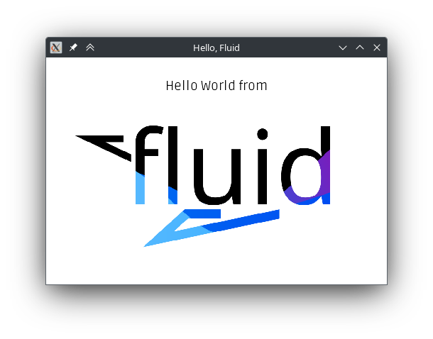

A flexible UI library for [the D programming language](https://dlang.org/). Minimal setup. Declarative. Non-intrusive.

```d
auto root = vspace(
    .layout!"center",
    label(
        .layout!"center",
        "Hello World from"
    ),
    imageView("./logo.png"),
);
```

Fluid comes with [Raylib 5][raylib] support. Integration is seamless: one or two calls do the job.

```d
while (!WindowShouldClose) {
    BeginDrawing();
        ClearBackground(color!"#fff");
        root.draw();
    EndDrawing();
}
```

[raylib]: https://www.raylib.com/

Fluid has a decent feature set at the moment and new features will still be added over time. Fluid is already mostly
stable and ready for use, but is still likely to receive a few breaking changes before leaving its pre-release stage.

**Support Fluid development on Patreon: https://www.patreon.com/samerion**

* Straightforward, high-level API
* Responsive layout
* Extensible
* Components easily combined together
* Reliable mouse and keyboard input
* Separate layout and styling
* Scrolling support
* Out-of-the-box Unicode support
* Code editor node included
* Full HiDPI support
* Partial gamepad support

## Get Fluid

For a quick start guide on Fluid, check out the tour:

```
dub run fluid:tour
```

Create a new [dub][dub] project based on Fluid:

```
dub init -t fluid
```

You can use [dub][dub] to include Fluid in your code:

```
dub add fluid
dub add raylib-d
dub run raylib-d:install
```

[dub]: https://code.dlang.org/

## Contribute to Fluid

Fluid welcomes contributions! You can review open issues and open pull requests to fix them.
If you need help, you'll receive it.

* [Open an issue](https://git.samerion.com/Samerion/Fluid/issues/new)
* [Review current goals](https://git.samerion.com/Samerion/Fluid/milestones?state=open&q=0.8&fuzzy=)

Read more about contributing to Fluid in our [contributing.md](contributing.md) file.
