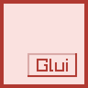

<h1>
    
    glui
</h1>

A simple high-level UI library designed for use in [IsodiTools](https://github.com/Samerion/IsodiTools) and Samerion.
I decided to write it because making one turns out to be faster and easier than trying to make raygui or imgui work
in D.

It implements a tree node structure, but doesn't provide an event loop and doesn't create a window, making it easier to
integrate in other projects.

It is guaranteed to work with Raylib, but might not work with other libraries or frameworks.

Glui has a decent feature set at the moment, but new features will still be added over time. It's mostly stable as of
now and ready to be used. What it's missing the most, is examples and documentation on design concepts behind it.
