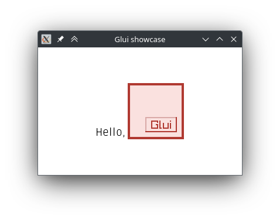

A declarative high-level UI library for game development in [the D programming language](https://dlang.org/) that works
out of the box. Minimal setup. Non-intrusive.

```d
auto root = hspace(
    .layout!"center",
    label(.layout!"end", "Hello, "),
    imageView("./logo.png", Vector2(96, 96)),
);
```

Glui comes with [Raylib 5][raylib] and [arsd.simpledisplay][sdpy] support. Integration is seamless: one or two calls do
the job.

```d
while (!WindowShouldClose) {

    BeginDrawing();

        ClearBackground(color!"#fff");
        root.draw();

    EndDrawing();

}
```

[raylib]: https://www.raylib.com/
[sdpy]: https://arsd-official.dpldocs.info/arsd.simpledisplay.html

Glui has a decent feature set at the moment and new features will still be added over time. Glui is already mostly
stable and ready for use, but is still likely to receive multiple breaking changes before leaving its pre-release stage.

**Support Glui development on Patreon: https://www.patreon.com/samerion**

* Straightforward, high-level API
* Responsive layout
* Extensible
* Components easily combined together
* Reliable mouse and keyboard input
* Separate layout and styling
* Scrolling support
* Out-of-the-box Unicode support
* Full HiDPI support
* Partial gamepad support
